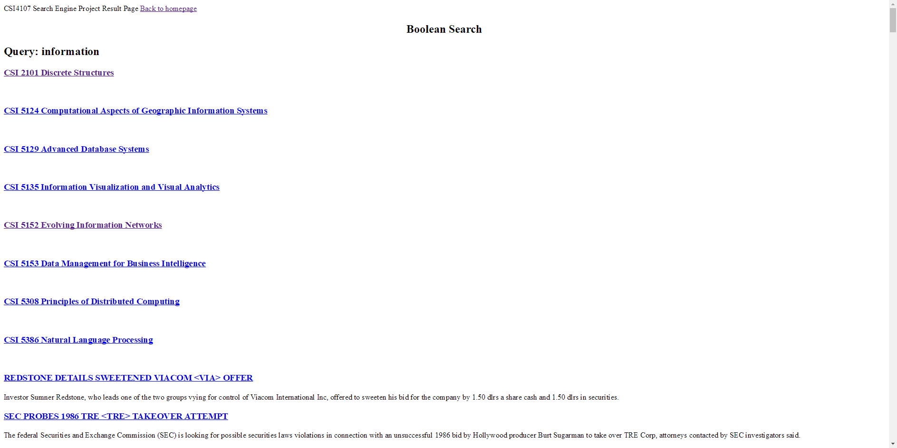
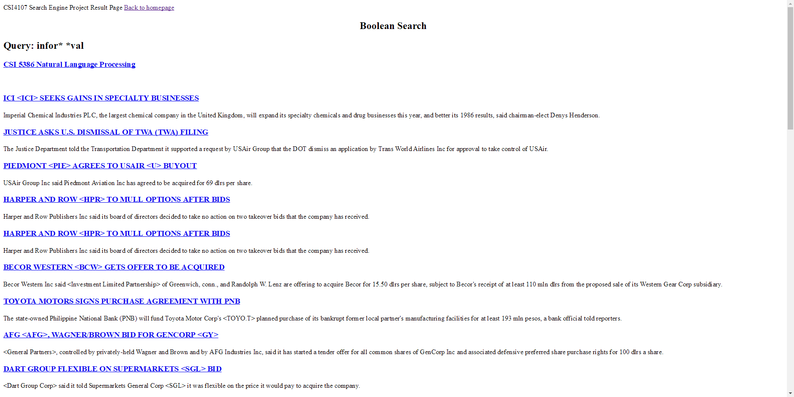
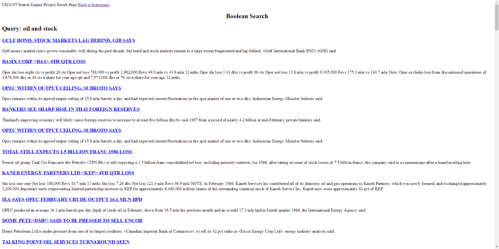
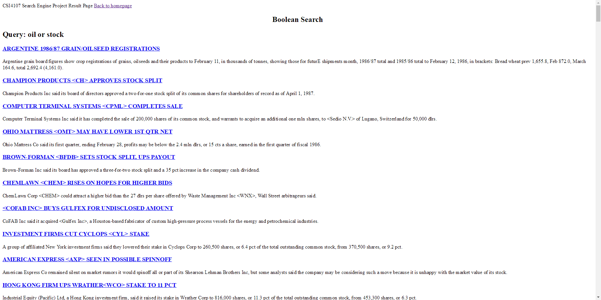

SearchEngine

<strong>Modules</strong>

<strong>Vector Space Model</strong> 
Modified and Inspired from
http://blog.christianperone.com/2013/09/machine-learning-cosine-similarity-for-vector-space-models-part-iii/
Allows people to choose from radio button and use vector space model as search model 

<strong>Bigram Models</strong> 
Which transfer two datasets(UO_corpus and reuters) to json file using simple bigram calculations. This system took me a lot of time because since first function is implemented, i started to generate the json file for bigram model. However, it took a long time to generate. I thought this function is not correctly implemented. Hence, it cost me 2 days to find a correct algorithm to implement this algorithm. At last, i found out it just took a while to calculate the result by simply add print() in it to actually see it works. This json file will show like this patten 
{ 
“Word1”:{ 
“Word2”: Float Number1(shows the bigram calculation result) 
“Word3”: Float Number2(shows the bigram calculation result) 
... 
&nbsp;} 
“Word4”:{ 
“Word5”: Float Number3(shows the bigram calculation result) 
“Word6”: Float Number4(shows the bigram calculation result) 
... 
&nbsp;} 
} 

<strong>Query Completion Module</strong> 
This module is inspired from 
https://stackoverflow.com/questions/44599411/jquery-autocomplete-with-python-and-webapp2
https://www.niallohiggins.com/2009/12/21/autocomplete-with-python-pylons-sqlalchemy-and-jquery/
To complete this module, just simply calculation from the previous step(bigram model) and with the top 10 of the results. Showing below the search field. The most difficult thing for me is link two platforms(html and python). It is always confuse which language should I wrote and the logistic meaning in the code.

<strong>Automatic Thesaurus Construction</strong> 
For this module, it is a very difficult module for me. Because there are many words inside the dictionary file. To manage those file might need a lot of time and the data output should be huge for my system. Therefore, to simplify the work, I choose thousands of the most frequency words to generate data.

<strong>Global Query Expansion(VSM)</strong> 
For this module, it is done in extraction and processing_thesaurus functions. Which appends the query to user’s search.

<strong>Text Categorization with KNN</strong> 
In python sklearn package, it has most of the categorization functions and also some function of KNN. Therefore, I used sklearn package to do the classification.

<strong>Search Results</strong> 
 
 
 
 
 
